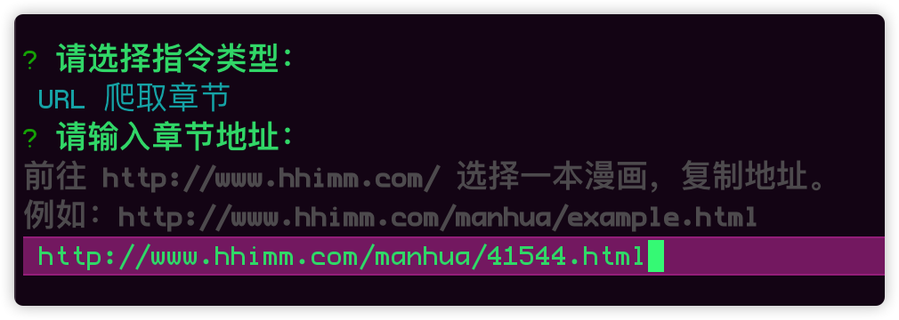
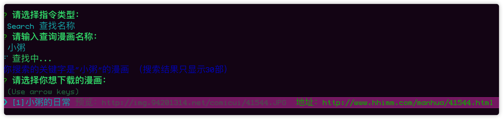
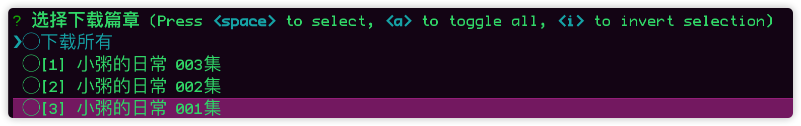
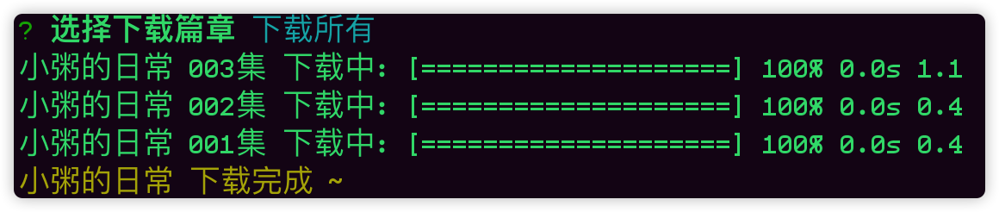

# comicz-cli 说明文档
一个下载 [hhimm](http://www.hhimm.com/) 网站漫画的命令行工具。

## 安装
```
npm install comicz-cli -g
```

## 使用方法
1. 终端输入
```
comicz-cli
```
2. 选择指令类型

  1. URL 类型
   
  2. Search 类型
   
3. 选择章节下载

4. 等待下载完成


## TODO
- [X] url
- [X] search