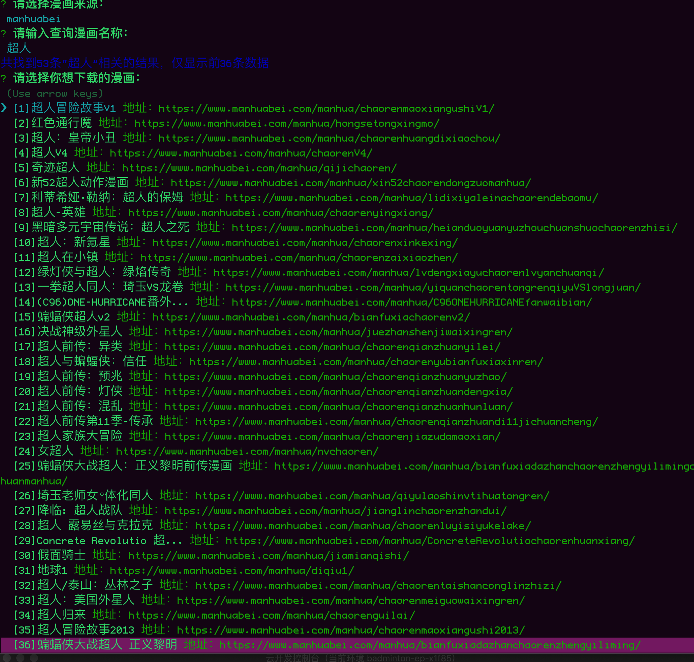

# comicz-cli 说明文档
一个下载漫画的命令行工具。

## 安装
```
npm install comicz-cli -g
```

## 使用方法
1. 终端输入
```
comicz-cli
```
2. 选择漫画收录来源

3. 检索查找的漫画名称

4. 选择需要下载的结果

5. 选择需要下载的章节（操作方式：空格选择，a选择所有，i反选，Enter确定

6. 等待下载完成


## 支持的源
- [X] http://www.hhimm.com/
- [X] https://www.manhuabei.com/
- [X] https://www.77mh.cool/index.html

## TODO
- [x] 多源选择
- [X] 查询
- [X] ~~地址爬取~~